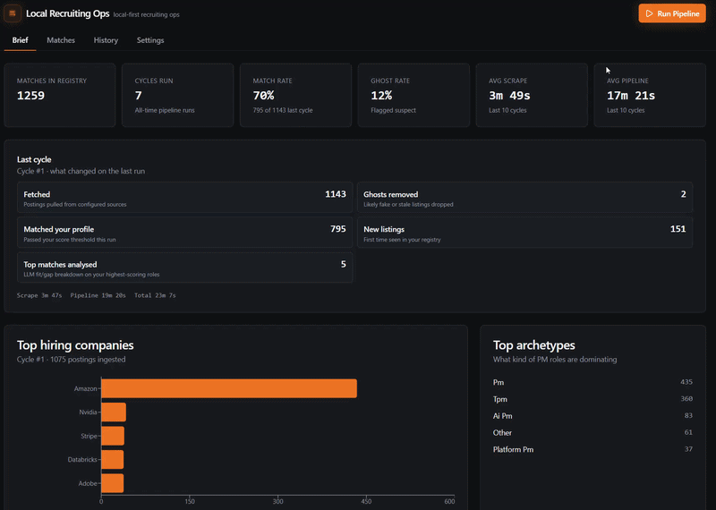
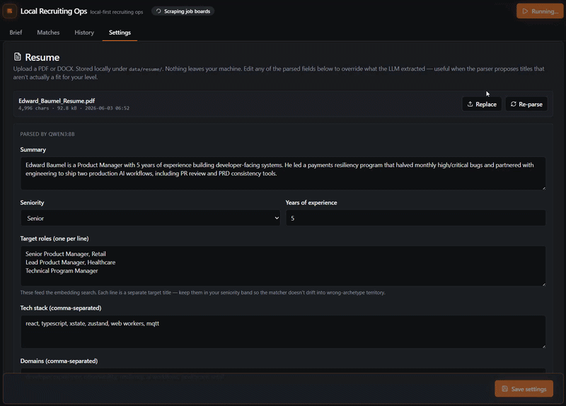

# Local Recruiting Ops

Local-first recruiting ops: scrape public ATS feeds, score roles against your resume with embeddings, flag ghost jobs — all on your machine via Ollama.

**[GitHub](https://github.com/edwardjbaumel/local-recruiting-ops)** · **[Setup](https://github.com/edwardjbaumel/local-recruiting-ops/blob/master/SETUP.md)** · **[Changelog](https://github.com/edwardjbaumel/local-recruiting-ops/blob/master/CHANGELOG.md)** · **v1.2.0**

---

## Demo





---

## What it does

Each cycle ingests hundreds of public job postings, scores them against your resume and surfaces a short shortlist:

| Stage | Tech | Role |
|-------|------|------|
| Ingest | Greenhouse, Lever, Ashby, Amazon, Workday, RemoteOK | Public ATS feeds only |
| Match | `BAAI/bge-m3` embeddings | Hard filters + cosine fit + ghost fold |
| Shortlist | Cap **80** match-tier rows | Matches tab stays readable |
| Analyse | `qwen3:8b` on top **8** | One-sentence fit / gap per role |

**Ghost detection** uses nine explainable signals (not a black-box score). **Star / dismiss** feedback nudges scores after three samples.

Dashboard tabs: **Brief** (market + funnel), **Matches** (scored list), **History** (cycles), **Settings** (resume, companies, models).

---

## Quick start

Requires Python 3.11+, Node 18+, [Ollama](https://ollama.com/download) and a GPU for sensible cycle times.

```powershell
git clone https://github.com/edwardjbaumel/local-recruiting-ops.git`ncd lro
.\start.ps1
```

The launcher bootstraps venv, builds the UI, starts Ollama and pulls **`qwen3:8b`** if missing. Opens [http://127.0.0.1:8099](http://127.0.0.1:8099).

1. **Settings → Resume** — upload your CV  
2. **Run Pipeline** — first cycle may take several minutes while embeddings download  
3. **Matches** — browse the cap-80 shortlist; open a row for fit/gap detail  

Hardware-specific model picks and GPU setup: [SETUP.md](https://github.com/edwardjbaumel/local-recruiting-ops/blob/master/SETUP.md).

---

## What's new in v1.2.0

- **Lean match path** — tighter embed tiers, match list cap, cross-encoder rerank off by default  
- **Faster cycles** — skip parse / analyse / archetype LLM calls when Ollama models are missing (no 404 spam)  
- **Google off by default** — ATS JSON sources need no parse step; enable Google only if you want those roles  
- **Brief match rate fix** — early-exit cycles record funnel stats correctly  

Full patch notes: [CHANGELOG.md](https://github.com/edwardjbaumel/local-recruiting-ops/blob/master/CHANGELOG.md#120--2026-05-26).

---

## Stack

Python orchestrator · React + TypeScript dashboard · sentence-transformers · Ollama · pytest + vitest · MIT License

Built by [Eddie Baumel](https://www.linkedin.com/in/edwardbaumel/).
